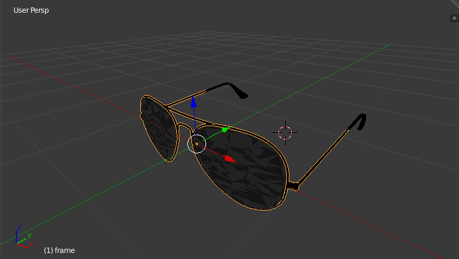
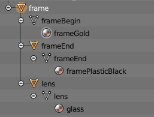
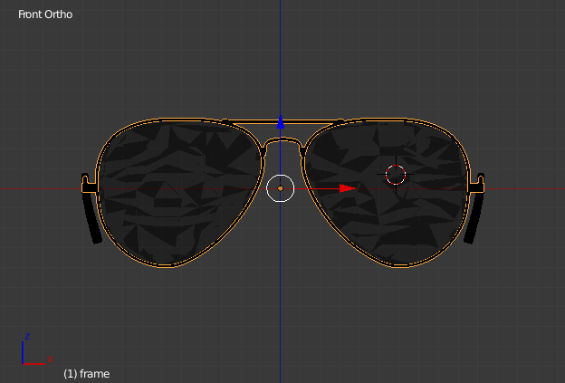
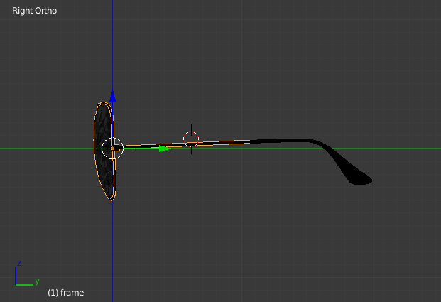
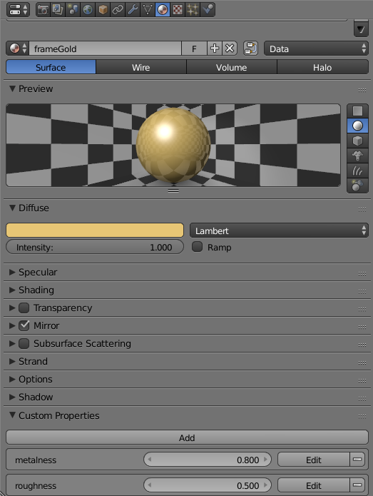

# Glasses 3D model specifications

## Table of contents

* [Introduction](#introduction)
* [Positioning and scaling](#positioning-and-scaling)
* [Materials](#materials)
  * [Parameters recovery](#parameters-recovery)
  * [Naming](#naming)
* [Exportation](#exportation)

## Introduction

You can use GLTF or GLB (i.e. binary GLTF) file format for your glasses 3D models. We recommend using GLB file format since it is more compact than GLTF. All modern 3D modeling software should support this file format. Here we describe the process using [Blender](https://blender.org). You can reproduce this process by exporting `/dev/glasses2.blend` to `assets/models3D/glasses.glb`.

The behavior for pose and materials can be modified in `WebARRocksMirror.js`.

Once you open `/dev/glasses2.blend` you should see the 3D view of the model:

  

We recommend to have a parent object gathering all parts of the 3D model. Here is a view of the scenegraph:

  

## Positioning and scaling
The model should be centered on the X axis (red, horizontal). The vertical axis should be the Z axis (blue).
The pupils should be on the X axis (red), i.e. their vertical coordinate should be `0`:

  

The branches should be parallel. The interior width of the glasses should be 2 in world units.
The most prominent part of the eyeballs should be tangent to the X axis (red), i.e. `Y = 0` and `Z = 0`:

  

The branches should touch the ears at Z = 0. It locks the rotation around the X axis (not visible here):

  

When the glasses are worn, the branches are no longer parallel, but bent to adapt to the shape of the head. The bending is handled by WebAR.rocks.mirror and you can set the bending angle.

## Materials

### Parameters recovery
Blender material parametrization does not match THREE.js material model.
Materials are recovered in THREE.js as [MeshStandardMaterial](https://threejs.org/docs/index.html#api/en/materials/MeshStandardMaterial) instances. These are PBR materials. Some material settings like `roughness` or `metalness` are not exported by default with Blender. So we have implemented a workaround.

Add *Custom Properties* in the material pannel, and name each property with the THREE.js property name:

  

Now when your export the model as GLTF or GLB, if you check the *Nodes / Export Extras* option, these parameters will be accessible in the THREE.js imported model in `<materialInstance>.userData`.
Then WebAR.rocks.mirror will automatically get them and use them as THREE.js material properties.

### Naming
*WebAR.rocks.mirror* tweaks the materials of the branches of the glasses in order to bend the banch, and to add a fading effect around the ears. *WebAR.rocks.mirror* will consider all materials whose name contains `frame` as a frame material, and will apply bending and fading effect. So, you should:

* Name all the material which should be bended and faded with a name containing `frame`
* Do not put the string pattern `frame` in other material names.

## Exportation
We use the standard Blender GLB exporter, not the THREE.js Blender exporter.
Be careful set these settings:

* *Nodes / Export Extras* should be checked,
* *Nodes / Convert Z up to Y up* should be checked.

For optimization sake, it is better to export only the 3D models (not the lights, the camera, ...).
